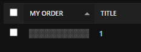

# Тестовое задание
1. Установить зависимости
```
pip install -r req.pip
```


2. Настроить базу данных в test_task/settings.py

Указать свои данные для полей NAME, USER, PASSWORD
```
DATABASES = {
    'default': {
        'ENGINE': 'django.db.backends.mysql',
        'NAME': 'test', 
        'USER': 'root',
        'PASSWORD': '#',
        'HOST': 'localhost',
        'PORT': '3306',
    }
}
```

3. Провести миграции
``` 
cd test_task
python manage.py makemigrations
python manage.py migrate
```

4. Создать суперпользователя
```
python manage.py createsuperuser
```

5. Запустить 
``` 
python manage.py runserver
```

# FAQ
Проект реализован при помощи Django 5.0.4, Python 3.10.5 и БД MySQL.

Использованы сторонние библиотеки: django-filer, django-admin-sortable2, Slick Slider, JQuery, Bootstrap, mysqlclient, lightbox2

Внешний вид сайта взят с макета Figma и настроен под корректное отображение.

# По пунктам задания:

Реализован слайдер при помощи Slick Slider (подвид Slider Syncing)

Добавлена галерея при помощи lightbox2, изображения открываются на полный экран и могут пролистываться.

Slider заполняется через админку. Для этого необходимо загрузить изображения при помощи Filer в разделе Folders (выбрав вручную, либо drag&drop в специальное поле), после чего перейти в Slider Images, нажать ADD SLIDER IMAGE и выбрать нужное изображение. Также необходимо указать короткое название для изображения.

В админке отображается превью изображения, его заданное название и поле MY ORDER.

Для сортировки при помощи drag&drop необходимо потянуть за черно-белый прямоугольник в поле MY ORDER



Все зависимости были расположены в файле req.pip
